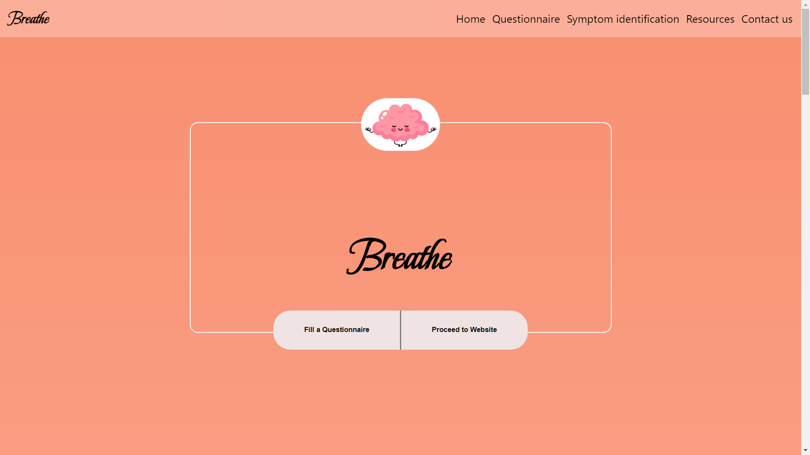
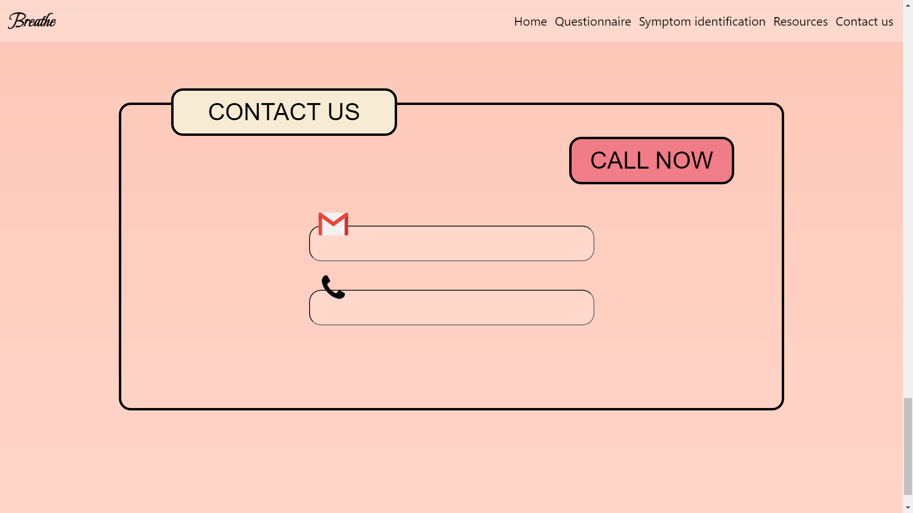

# Breathe: A Serene Adventure

## Title

Breathe gives the user a platform where they can seek help anonymously, get validation for their feelings and take the first step in their healing journey. The app will have calming colors, statistics page, questionnare and resources to calm down or listen to a podcast.

## Tech Stack Used

HTML
CSS
React.js

## Team Description

Team Member Name: Vishrut Aggarwal
Team Member GitHub: https://github.com/VishrutAggarwal
Team Member Socials: [Linkedin](https://www.linkedin.com/in/vishrut-aggarwal/)

Team Member Name: Akanksha Kushwaha
Team Member GitHub: https://github.com/aku1310
Team Member Socials: [Linkedin](https://www.linkedin.com/in/akankshakushwaha/)

Team Member Name: Jahanvi Joshi
Team Member GitHub: https://github.com/jahanvi15
Team Member Socials: [Linkedin](https://www.linkedin.com/in/jahanvi-joshi-6645471b5/)

Team Member Name: Siddhant Vats
Team Member GitHub: https://github.com/siddhantvats05
Team Member Socials: [Linkedin](https://www.linkedin.com/in/siddhant-vats/)

## Screenshots and reference Images

## Links and References: 

- [Devfolio](your_devfolio_link_here)

- [GitHub](https://github.com/aku1310/breathe)

- [Google Drive](your_demo_video_link_here)